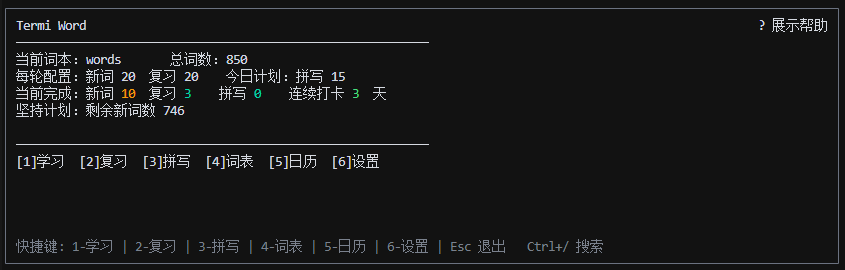
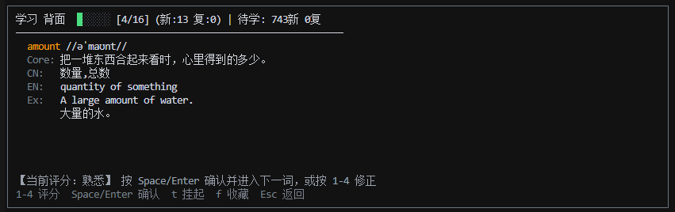
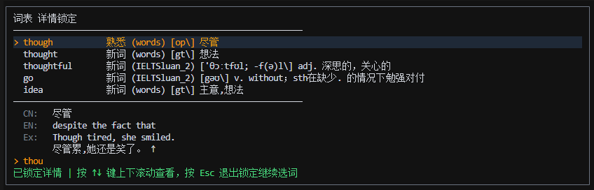

# Termi Word

一个专为终端用户打造的摸鱼/高效背单词工具，基于 Textual和FSRS算法。

## 特性

- 命令行原生：不用起重型客户端，分出终端小窗就能默默背词。
- 窗口动态自适应：界面能在 `6-16` 行高间弹性适配。长词义和例句自动折行，支持 `↑↓` 方向键平滑滚动。
- 全键盘操作：双手无需离开主键盘区，所有功能一键直达。
- 自定义任何词包：直接将 CSV 词书放入 `termi_data/imports/` 即可导入，支持自定义列名映射。
- 拼写练习：支持拼写，打字时顶部提供实时进度与对错反馈。

这里是可以直接下载或复制使用的测试850简单单词表：[words.csv](termi_data/imports/words.csv)
下载release中的包解压后, 将这个words.csv放入同级目录的termi_data/imports/words.csv下就可以正常导入开始学习了
即目录结构如下
```text
termi_word_windows/
├── termi_data/
│   ├── imports/            <-- 你的词书, 在此存放和更新
│   │   ├── words.csv
│   │   ├── other_words.csv
│   └── termi_word.sqlite3  <-- 你的设置和历史数据
├── termi_word/
├── greenlet/
├── sqlalchemy/
├── termi_word.exe
└── ...
```





## 快捷键与使用指南

### 1. 全局快捷键

| 快捷键 | 功能 | 说明 |
|:---|:---|:---|
| `Ctrl + /` | 打开全局单词搜索 | 可以在任意界面唤起搜索，返回后自动关闭 |
| `Ctrl + Z` / `Ctrl + Q` / `Ctrl + C` | 安全退出 | 双击 `Esc` 也可以安全退出，退出前会自动保存数据并释放连接 |
| `Esc` | 返回上一级 / 取消锁定 | 用于从子页面退回主页面或取消编辑/锁定状态 |
| `?` (或 `Shift + ?`) | 显示/隐藏底部快捷键栏 | 可以在大多数页面上切换底部帮助信息的可见性 |

### 快捷键(可使用?查看)
**学习/复习页面**

使用间隔重复记忆系统（FSRS）。

| 快捷键 | 功能 | 说明 |
|:---|:---|:---|
| `Space` / `Enter` | 翻卡 / 确认评分 | 单词正面按此键可翻转展示背面释义与例句 |
| `1` | 陌生 (Again) | 没记住，重新学 |
| `2` | 熟悉 (Hard) | 勉强记住，下次复习间隔较短 |
| `3` | 记得 (Good) | 顺利记住（推荐），复习间隔正常 |
| `4` | 掌握 (Easy) | 牢固掌握，复习间隔较长 |
| `s` | 跳过 (Skip) | 临时跳过当前词，不记录评分与进度 |
| `t` | 挂起单词 (Suspend) | 永久停用该词。挂起后未来的任何背诵和拼写练习都不再调度该词 |
| `f` | 收藏/取消收藏 (Star) | 切换收藏状态（卡片右上角将标记 `*`），便于后续单独过滤复习 |
| `↑` / `↓` | 垂直滚动 | 释义或例句过长溢出面板时，按上下方向键平滑滚动查看全部内容 |
| `Esc` | 返回 | 中途返回主页面，系统会自动保存当前已完成的背诵进度 |

**词表浏览与搜索页面**

展示当前词本的所有单词，支持关键字实时模糊搜索。

| 快捷键 | 功能 | 说明 |
|:---|:---|:---|
| `↑` / `↓` | 移动光标 | 在单词列表中上下移动选择单词 |
| `f` / `Ctrl + F` | 切换仅看收藏 | 切换是否仅过滤已收藏的单词（输入框聚焦时必须使用 `Ctrl+F` 触发） |
| `Enter` / `Space` | 锁定底部详情 | 将当前单词的详细释义卡片锁定。锁定后可按 `↑` `↓` 键滚动阅读超长内容。再次按该键或 `Esc` 解锁 |
| `Backspace` | 删除搜索字符 | 更改搜索输入内容 |
| `Esc` | 退出 | 退出搜索框焦点 / 退出详情锁定 / 返回主页面 |


---

## 如何导入与管理词包 CSV

你可以放入自定义词本。只需将 CSV 文件放到运行目录下的 `termi_data/imports/` 目录中，程序启动时会自动扫描识别。

### 1. 推荐的 CSV 表头 (开箱即用)

如果你的 CSV 文件表头（第一行）使用以下列名，TermiWord 会自动匹配：

| 列名 | 说明 | 示例值 | 是否必须 |
|:---|:---|:---|:---|
| `w` | 单词 (Word) | come | 必须 |
| `c` | 词性 / 分类 (Category) | op | 可选 |
| `zh` | 中文释义 (Chinese) | 来,前来 | 推荐 (用于背诵时查看) |
| `en` | 英文释义 (English) | move toward the speaker or a place | 可选 |
| `us` | 音标 (Pronunciation) | /kʌm/ | 可选 |
| `core` | 核心释义 (Core Meaning) | 朝说话者或目标靠近，让彼此距离变短。 | 可选 |
| `ex` | 英文例句 (Example) | Come here when you're ready. | 可选 |
| `exz` | 例句翻译 (Example Trans) | 准备好了就过来。 | 可选 |

示例格式：
```csv
w,c,zh,en,us,core,ex,exz
come,op,"来,前来",move toward the speaker or a place,/kʌm/,朝说话者或目标靠近，让彼此距离变短。,Come here when you're ready.,准备好了就过来。
get,op,"得到,获得;变得","obtain, become, or receive",/ɡɛt/,把东西收到手里，或让状态变成新的样子。,I'll get a new book tomorrow.,我明天会买本新书。
```

### 2. 自定义 CSV 列名映射

如果你的 CSV 词书列名与推荐的并不一致（例如使用 `Word` 代替 `w`，`Translate` 代替 `zh`）：

1. 准备 CSV 文件：确保为UTF-8编码且第一行为表头，将其放入程序所在的目录的 `termi_data/imports/` 目录下（如 `my_words.csv`）。
2. 在应用中绑定字段：
   - 进入系统设置与词书管理界面。在 CSV 列表中选中 `my_words.csv` 并按回车设定为当前词书。
   - 在下方的 “映射关系配置” 中，按 `Enter` 循环切换，将 `单词映射(w)` 绑定到 `Word` 列，`中文映射(zh)` 绑定到 `Translate` 列。
   - 移动光标到最下方的 `[确认执行同步]` 按回车，再次按 `y` 确认。

### 3. 将 JSON 词包转换为 CSV 格式

如果你有 JSON 格式的外部词表，可以直接使用项目中简易的转换脚本 `scripts/convert_json.py`：

```bash
# 执行转换（自动生成并保存至 termi_data/imports/my_words.csv）
python scripts/convert_json.py path/to/my_words.json
```

#### 支持的 4 种典型 JSON 输入格式参考：

**【格式 1】标准对象数组**
```json
[
  {"w": "abandon", "zh": "vt. 放弃，遗弃", "us": "/əˈbændən/", "ex": "He abandoned his car."},
  {"w": "ability", "zh": "n. 能力，才能", "us": "/əˈbɪləti/"}
]
```

**【格式 2】包含列表的包裹字典**
```json
{
  "title": "CET-4 核心词汇",
  "words": [
    {"word": "abandon", "translation": "vt. 放弃", "phonetic": "/əˈbændən/"}
  ]
}
```

**【格式 3】单词-释义键值对**
```json
{
  "abandon": "vt. 放弃，遗弃",
  "ability": "n. 能力，才能"
}
```

**【格式 4】JSONLines 逐行文件**
```json
{"w": "abandon", "zh": "vt. 放弃"}
{"w": "ability", "zh": "n. 能力"}
```

*提示：若你的 JSON 键名比较特殊（如使用 `"headWord"` 或 `"tranCn"`），脚本会自动识别大部分常见命名。如需自定义，可随时在 [scripts/convert_json.py](termi_word/scripts/convert_json.py) 顶部的 `FIELD_MAP` 中增减候选键名。*

---

### 4. 如何修改或更正已有词书

如果你发现词书里的单词释义有误，或者想补充例句：

1. 直接修改CSV：打开 `termi_data/imports/` 下的对应 `.csv` 文件，直接修改错别字或补全释义。
2. 重新同步数据：打开程序进入设置界面，选中对应词书并点击 `[确认执行同步]`。系统会自动覆盖更新修改后的释义，同时保留你现有的背词进度和复习卡片。
3. 挂起问题单词：背词过程中如果遇到不需要背的词，按 `t` 键并按 `y` 确认，即可挂起该单词，后续复习将自动忽略它。

---

## 本地开发与运行

```bash
python -m venv .venv
source .venv/bin/activate
.venv\Scripts\activate     # Windows
pip install -r requirements.txt

# 运行 TUI 单词工具
python -m termi_word
```

---

## 打包指南

项目使用 Nuitka 的 `standalone` 模式进行构建。构建脚本会自动生成压缩包文件：

- Windows: `output/termi_word_windows.zip`
- Linux: `output/termi_word_linux.tar.gz`
- macOS: `output/termi_word_mac.tar.gz`

## 本地打包步骤

安装依赖
```bash
pip install nuitka
```
执行构建：
- Windows (PowerShell): `.\scripts\build.ps1`
- Linux / macOS (Bash): `./scripts/build.sh`

构建完成后，打包好的归档压缩文件直接保存在 `output/` 目录下。

---

## 项目结构

```text
termi_word/
├── scripts/
│   ├── build.ps1           # Windows 本地打包脚本
│   └── build.sh            # Linux/macOS 本地打包脚本
├── termi_word/
│   ├── app.py              # TUI 应用入口
│   ├── config.py           # 配置与路径映射
│   ├── runtime_paths.py    # 运行时数据路径解析
│   ├── database/           # 数据库与 ORM 模型
│   ├── screens/            # TUI 页面视图
│   └── services/           # 业务服务逻辑
└── styles/
    └── app.tcss            # TUI 界面样式
```
